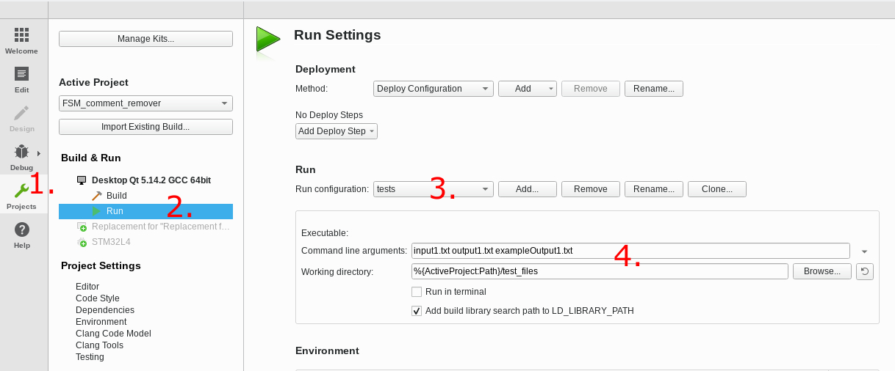

#  Zpracování textů - konečný automat
Naprogramujte **konečný Mealyho automat**, který ze vstupního souboru v jazyce C/C++ odstraní poznámky (tzn. vše mezi znaky /* */ nebo // \n).

## Ošetření vstupů
- puts("Toto je řetězec //a toto ani /* toto */ neni poznámka");
- putchar('"'); /* Toto byl znak uvozovky, ne řetězec. Takže toto je poznámka */
- backslash: puts ("Toto \" je stále řetězec"); // to samé platí i pro znakové konstanty  v apostrofech: _'\''_

## Vstup programu
- soubor zadaný jako 1. parametr na příkazové řádce
- standardní vstup (stdin), pokud parametr není zadán

## Výstup programu
- do souboru, který byl zadán jako 2. parametr na příkazové řádce
- na standardní výstup (stdout), pokud 2. parametr není zadán

Pokud je na příkazové řádce pouze 1 parametr, bere se tento parametr jako jméno vstupního souboru.

V adresáří test_files najdete vzorový výstup.

## Nastavení pro lokální spouštení jednotkových testů v Qt Creator

Aby bylo možné spustit jednotkové testy z Qt Creatoru, je nutné přidat vstupní parametry do nastavení projektu.
Následující obrázek ukazuje postup pro nastavení.

1. Přepneme se do nastavení projektu
2. Pod námi používanou konfigurací projektu zvolíme položku **"Run"**
3. Z výběru vybereme konfiguraci pro jednotkové testy **"tests"**
4. Jako argumenty pro spouštění jednotkových testů nastavíme 3 soubory `input1.txt output1.txt exampleOutput1.txt`
   a pracovní složku nastavíme na hodnotu: `%{ActiveProject:Path}/test_files`
   
Podobné nastavení můžeme provést i pro konfiguraci **FSM_comment_remover** kde jako vstupní argument nastavíme `input1.txt` a nastavení pracovní 
složky zůstane stejné jako v bodě 4.

---
#  Text processing - finite automaton
Program **finite Mealy automaton**, which removes the notes (ie everything between / * * / or // \ n) from the C / C ++ input file.

## Input treatment
- puts ("This is // and this or /* this */ is not a comment"); 
- putchar ('"'); /* This was a quotation mark, not a string. So this is a note */
- backslash: puts ("This \" is still a string "); // the same applies to character constants in apostrophes: _'\''_

## Program input
- File specified as the 1st parameter on the command line
- standard input (stdin) if parameter is not specified

## Program output
- to a file that was specified as the second command line parameter
- to standard output (stdout) if parameter 2 is not specified

If there is only one parameter on the command line, it is taken as the name of the input file.

You can find sample output in the test_files directory.

## Settings for running unit tests locally in Qt Creator

Te be able to run unit tests from Qt Creator, we need to update run configuration settings inside Qt Creator.
Following picture shows steps for configuring Qt Creator.

1. Switch to project settings
2. Under Build & Run select **"Run"** settings
3. From run configuration dropdown menu select **"tests"**
4. Set following 3 files `input1.txt output1.txt exampleOutput1.txt` as command line arguments and working directory has to be set to this value:
   `%{ActiveProject:Path}/test_files`

Same configuration can be done for run configuration **FSM_comment_remover** where input arguments should be set to `input1.txt` and working 
directory should be the same as in item 4 from previous list.
